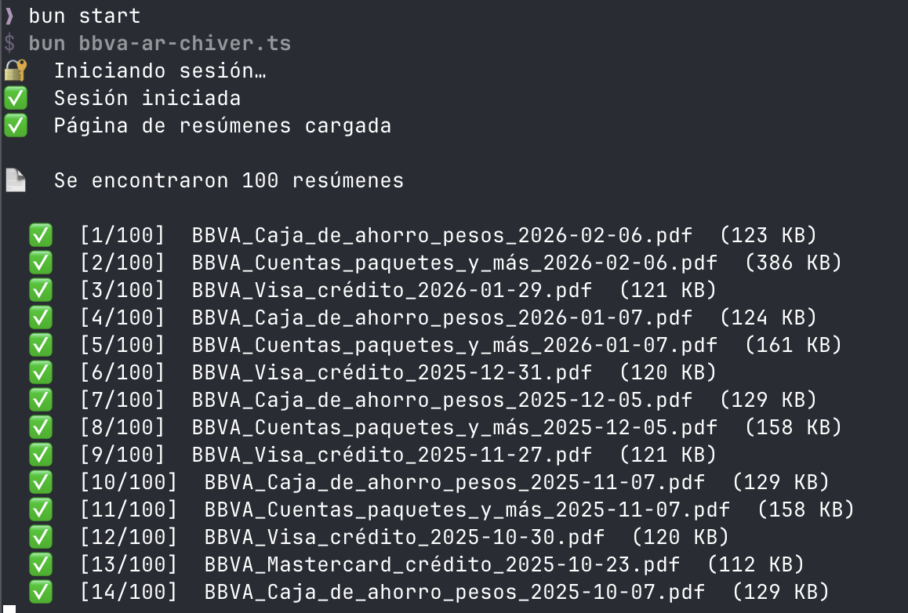

# BBVA Argentina — Descarga de Resúmenes PDF

Script de automatización que inicia sesión en el home banking de BBVA Argentina y descarga todos los resúmenes de cuenta disponibles en PDF.

## Requisitos

- [Bun](https://bun.sh) — runtime de JavaScript/TypeScript
- Firefox (instalado por Playwright, ver más abajo)

## Instalación

```bash
# 1. Instalá las dependencias
bun install

# 2. Instalá el navegador Firefox que usa Playwright
bunx playwright install firefox
```

## Configuración

Creá un archivo `.env` en la raíz del proyecto con tus credenciales:

```env
BBVA_DNI=12345678
BBVA_USUARIO=tu_usuario
BBVA_CLAVE=tu_clave
```

| Variable | Descripción | Requerida |
|---|---|---|
| `BBVA_DNI` | Número de DNI | Sí |
| `BBVA_USUARIO` | Usuario de home banking | Sí |
| `BBVA_CLAVE` | Contraseña de home banking | Sí |
| `BBVA_OUT_DIR` | Carpeta donde guardar los PDFs (por defecto: `./bbva-resumenes`) | No |
| `HEADLESS` | Poner `false` para ver el navegador en acción (por defecto: `true`) | No |

## Uso

```bash
# Descarga normal (navegador invisible)
bun start

# Ver el navegador mientras trabaja (útil para depurar)
bun start:headed

# Guardar los PDFs en una carpeta específica
BBVA_OUT_DIR=~/Documentos/BBVA bun start
```

## Salida

Los archivos se guardan con el formato:

```
BBVA_<nombre_tarjeta>_<año>-<mes>-<día>.pdf
```

Por ejemplo: `BBVA_Visa_2024-11-15.pdf`

Si un archivo ya existe, se omite automáticamente. Podés volver a ejecutar el script en cualquier momento para descargar solo los resúmenes nuevos.



## Cómo funciona

```
main()
  ├─ login()               — completa el formulario (DNI, usuario, clave) y hace clic en Ingresar
  ├─ waitForLandingPage()  — espera la redirección a la posición global y descarta el modal
  │                          de ayuda si aparece
  ├─ goToSummaries()       — navega al menú "Resúmenes y tarjetas → Resúmenes"
  ├─ getAllStatements()     — inyecta JS en la página para leer el controlador AngularJS (sumCtrl)
  │                          y obtener la lista de resúmenes disponibles
  └─ downloadAll()         — descarga cada PDF usando el servicio $http de Angular
                             (ya autenticado), lo convierte a base64 y lo escribe al disco
```

El script usa Firefox con zona horaria y locale argentinos (`es-AR`, `America/Argentina/Buenos_Aires`) para que la sesión del banco funcione correctamente.

## Aviso

Esta herramienta es para **uso personal exclusivo**. Tus credenciales solo se usan para iniciar sesión directamente en el sitio de BBVA; nunca se envían a ningún servidor externo.
